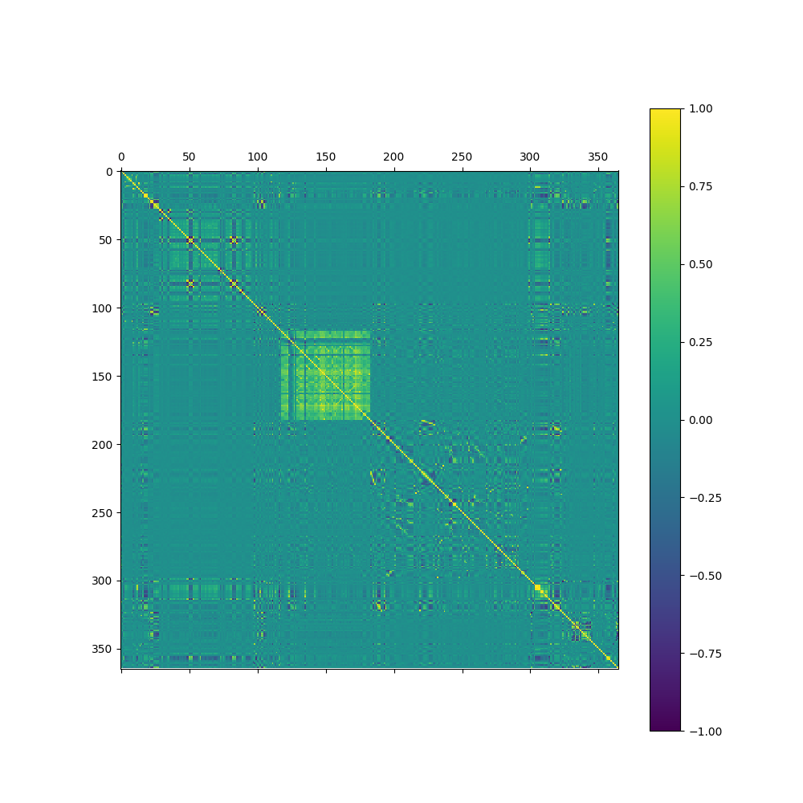
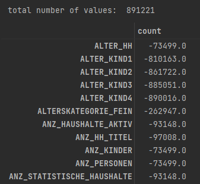
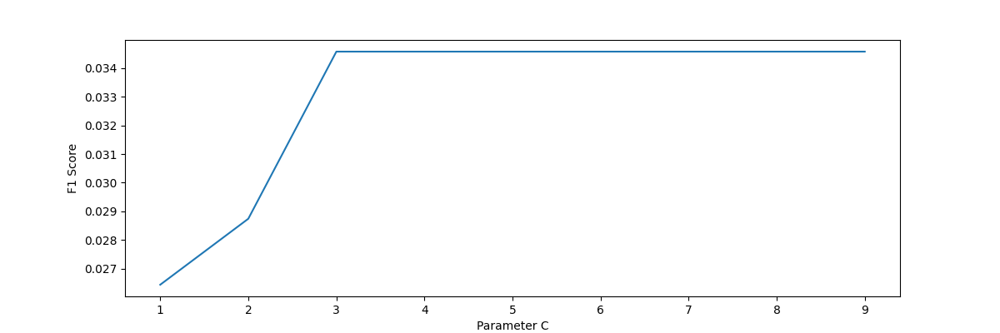
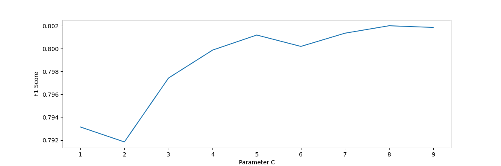

# Customer segmentation with demographic data

## High-level overview
Customer segmentation plays an important role in data driven e-commerce. The goal of this project is to separate customer data, that has been collected from the total population of Germany. With the separation, we can identify possible customers for our company and therefore can place advertisement or send out offers, to acquire new customers.  
In this blogpost, we will analyse demographic data, which was provided by Bertelsman and Arvato. The analysis is split up in two parts. In the first part we will use unsupervised learning methods to analyse and find new possible customers, which we can target with a marketing campaign. In the second part, we will train a supervised machine learning model with labeled data from a previous campaign to further narrow down possible customers, who will react to the offers we will send via mail.

The two major questions this blog post answers can be summarized as follows:
1. How can we identify possible new customers for the company from the whole population?
2. Can we predict if a customer will react positive if the company sends mails with offers to a certain person?

We will answer these questions in the following sections.

## Description of Input Data
The data we have consists of four data sets. All data sets consist of 366 features that describe the demographic situation of each person. 
The features are things like age of main household person, age of children, household type (wealthy househol with children, comfortable household elders in retirement, etc.), but also things that describe the buying capacity of the area, the person lives in, e.g.: number of luxury vehicles in that area, number of single households, number of families, etc.
Some datasets have additional features and the datasets themselves are described below.

1. customers
	The customers describes the current customers of the company. Three additional features exist, that describe their purchase behaviour. (about 191k Customers)
	
2. azdias
	Representatively describing the whole population of Germany. (about 900 k people)
	
3. mailout_train
	Targets of a mailing marketing campaign. Additional to the features, this dataset contains their response to the marketing campaign as well (boolean). Here we have about 850 True labels and about 65k False.

4. mailout_test
	Here we have the same data as mailout_train, but without the response labels.

## Strategy for solving the problem
Since we have two major questions, we want to answer, we need two strategies. One to find the people in the population that are similar to the current customers and one to find out which of these are prone to a mail with offers.

### Finding future customers in the population 
To find possible future customers in the population, we will have to find similarities between the customer dataset and the azdias dataset (population dataset). Since the azdias dataset does not have any labels, we can only use unsupervised learning techniques here.
To find similarities to the current customers we are going to cluster the population and find out, how our customers fit into the computed clusters.  

#### Clustering Algorithm
As a clustering algorithm we will use [KMeans](https://developers.google.com/machine-learning/clustering/algorithm/advantages-disadvantages) clustering since KMeans clustering scales easy to large datasets and has a guranteed convergence. It is worth wile testing other clustering methods. Since this is an initial analysis, only Kmeans was tested. Nevertheless, some methods like DBScan are not appropriate, since the dataset is very large and [DBScan](https://python.plainenglish.io/how-does-the-dbscan-algorithm-work-pros-and-cons-of-dbscan-bbdd589d837a) has comparatively high computational costs. It also does not guarantee to find all clusters in the data

#### Dimension Reduction
Eventhough KMeans clustering can easily be scaled to large datasets, it makes sense to reduce the data further. Dimension reduction is an important step, however dropping features is not, since we don not know how they affect the performance of our methods.

For the dimension reduction, three commonly known methods were considered:
- Independent Component Analysis (ICA)
- Principal Component Analysis (PCA)
- Kernel PCA

Kernel PCA was not practical to use since it is very memory consuming, which is why no results exist for the kernel PCA.
For the other dimension reduction (DR) algorithms, both were tested with the KMeans clustering and evaluated based on their ability to homogeneous distribute the population across each cluster. The code for tested pipelines can be seen in the [modeling section](#modeling).

### Predict Success on Mail Campaign
The next goal was to identify people that would react positive to a mailing campaign. For that task, the mailout_train dataset was provided, which had the same feature set as the azdias dataset but with additional labels from a previous mail campaign, which were use to train a supervised classifier to predict if a person would react positive to the mail campaign or negative.
The classifier used was a Support Vector Classifier (SVC), due to their ability to handle high-dimensional spaces, imbalanced datasets, and non-linearly separable data. With the selectable kernel function, high dimensional data can be classified better than using Randome Forest for example. In addition, SVC tends to be more robust to overfitting and requires fewer training examples than Random Forest.
The SVC algorithm was then tuned using gridsearch and cross validation (CV), which is explained in the section [modeling](#modeling).

## Discussion of the expected solution
It is expected, that the clustering algorithm clusters the population in a homogeneous way and that the customers can clearly visually be separated from the rest of the population. The customers should be highly representative in a few clusters, such that the conclusion can be drawn that people in some clusters are more similar to the customers group and that some clusters are more likely to be attracted by a mail offer.

With the clusters created, a classification algorithm will be trained. Here we will probably encounter issues with the imbalanced data. Here we will have to try out different methods to overcome this issue.

## Metrics
For classification algorithms, different [scores](https://en.wikipedia.org/wiki/Evaluation_of_binary_classifiers) exist, which can be used. Precision and Recall, are some of them.
The precision score describes the ability of the classification algorithm to find positive values in the data. The Mathematical description is the fraction of `TP` values and `TP+FP`. The precision metrics has one major drawback, it does not provide any information about the negative scores. A high precision does not mean that the algorithm can classify everything accordingly. If we wanted to chose the precision, we would definitely have to take a look at the recall as well. The recall describes the ability of the classifier to detect positive values. Using both precision and recall scores together helps ensure that the classifier is not only able to correctly detect positive examples but also minimizes false positives. This combination gives a comprehensive view of the classifier's performance.
Since we want to optimize one value, the most common metrics to use is the F1 score. The F1 score is defined as $F1 = 2TP/(2TP+FP+FN)$. The  F1 score takes into account both precision and recall, providing a single metric that balances their contributions. By combining these two metrics, F1 score offers a batter understanding of a classifier's performance.

## Exploratory Data Analysis
To get a better overview of the data, we are going to analyse the azdias data set in more detail. 
There are three aspects that we will focus on:
1. Correlation matrix
2. Missing values
3. Information value

### Correlation Matrix
Since we already know the basics of the data (size, shape, etc.), which was described in the section [Description of Input Data](#description-of-input-data), we can take a look into detail. We will start of with the correlation matrix, which we see below.



We can see that most of the data does not really correlate, which is good for us, since we want the features to be as independent as possible, to have more information in the data. We still have a cluster of data that have a high correlation between features 120-180. These features are related to cars and the number of car-types in the area the person lives in, therefore a correlation is obvious. 

### Missing Values
As expected, the data hase some missing values. The number of missing values for some features can be seen below:

We can see that a lot of data is missing here. Which we will have to impute. Fortunately, the data has already a default value for missing data, which is `-1`, therefore we can replace the missing values with `-1`.
It should still be noted, that the data shows, that there are groups of missing values. These grouops have the same number of data missing. We see that in the image below, which shows the number of missing data on the left and the features with that number of missing data on the right.

If we take a more detailed look at the highest number of similar missing data columns, we see that these are due to the fact, that they have the same data source. E.g.: the highest group here with about 105,8k missing values is from the `KBA_*`, which is related to the data that most likely comes from the KBA (Kraftfahrtbundesamt, German Federal Motor Transport Authority).

### Information Value
With that much missing values it makes sense to ask if the data from each person contains enough information to use in our analysis. To answer that, we will take a look at the missing data per column histogram below.


Her we see that most of the customers have less than approx. 30 missing values. We may consider dropping customers with more than 50 missing values. Thus we are left with more information filled rows.

## Data Processing
The following chapter summarizes the steps taken to clear the data.

### Nan Values
First the nan values were replaced. For some unknown data points, multiple values were given e.g.: `-1,9`or just `-1` or even `-1,0`. The first step to take was to unify the unknown data. We achieved that by replacing these values with `-1`' s, which is the default for unknown values in other columns.

```python 
def replace_unknowns(data):  
    replace_dict = {'-1,0': '-1', '-1,9': '-1'}  
    data.replace(replace_dict, regex=True, inplace=True)  
    return data
```
After that, Nan values were replaced with `-1`s. As stated, this is the default value for unknown data points.
As stated in the [section before](#information-value), we observed, that in a lot of columns, we have too much missing data. Thats why we also dropped rows with more than 50 missing values. The Code can be seen below:
```python
def drop_useless_rows(data):  
    more_than_50_missing = data.isna().sum(axis=1) > 50  
  index_50_missing = more_than_50_missing[more_than_50_missing].index  
    data = data.drop(index_50_missing)  
  
    return data  
  
print(azdias.shape)  
azdias = drop_useless_rows(azdias)  
print(azdias.shape)

>> (891221, 366)
   (751331, 366)
```
We may have lot about 15% of the rows, but we are still left with a lot of data AND we gained additional data quality with low effort.

### Handle Categorical Data
The categorical data in the data set was mostly because some columns had and `X`or a `XX` as a representative for missing data. These values were replace with the default value, `-1`'s and transformed to `int` values

Other columns had data like this:
|index|value|
|-|-|
|0|8A|
|1|4C|
|2|2A|
|3|6B|
|4|8C|
|5|4A|
|...|...|

Here the Letters were replaced with their according number in the alphabet, which lead to the following final form:
|index|value|
|-|-|
|0|81|
|1|43|
|2|21|
|3|62|
|4|83|
|5|41|
|...|...|

The only column with a datetime was dropped, since the `sklearn` algorithms can not handle datetimes.

### Summary
The cleaning steps lead to the following cleaning function:

```python
common_columns = azdias.columns

def clear_data(data):  
    temp_data = data.loc[:, common_columns]  
    temp_data = handle_nans(temp_data)  
    temp_data = clear_categorical_data(temp_data)  
  
    return temp_data
```

## Modeling
### Clustering algorithm
For the modeling of the methods, a sklearn pipeline was used to test the two dimension reduction algorithms. These can be seen below.
```python
cluster_pipeline_ica = Pipeline([
                                ('scaler', StandardScaler()),
                                ('dim_reduction', FastICA(n_components=120, max_iter=300)),
                                ('cluster', KMeans(n_clusters=12, n_init=15, max_iter=200, verbose=1))
                               ])

cluster_pipeline_pca = Pipeline([
                                ('scaler', StandardScaler()),
                                ('dim_reduction', PCA(n_components=0.90)),
                                ('cluster', KMeans(n_clusters=12, n_init=15, max_iter=200, verbose=1))
                               ])
```

Independent Component Analysis (ICA) and Principal Component Analysis (PCA) are popular techniques used for dimension reduction in large datasets. Both methods aim to transform the original dataset into a lower-dimensional space while keeping as much of the information in the data as possible. However, there are several key differences between the two approaches:
ICA seeks to find independent components from a multivariate distribution, assuming that the underlying sources are statistically independent of each other. Each component represents a unique patern in the data that cannot be described as a linear combination of any other patterns.
On the other hand PCA works under the assumption that the original data lies close to a low-dimensional subspace spanned by a few dominant directions called principal components. These components represent the most significant variation in the data and can be thought of as new axes along which the data varies.

### Classification algorithm
For the classification algorithm a Support Vector Classifier was selected. The goal of SVC is to learn a decision boundary that separates the classes. It works by mapping the input data into a higher-dimensional feature space using a function known as a kernel. Then, it constructs a hyperplane in this mapped space that maximally separates the different classes. The kernel has to be selected manually, which will be part of the hyper parameter tuning.

## Hyperparameter Tuning
For the Hyper parameter tuning of the clustering algorithms, random search was applied for the `n_components` parameter. 5-10 parameters were tested and have been manually selected. Since the evaluation of the separation was based on visual separation of the customer dataset from the population dataset.

For the classification algorithm we have a parameter to optimize, the F1 score. Therefore the hyperparameter tuning was focused on optimizing the classification. The optimization was split up in two steps, the first step considered more kernel functions and a few hyper different hyper parameters. The goal of the first search was to find the best kernel. The parameters can be seen below:
```python
gridsearch_params = gridsearch_params = {  
					    'classifier__C':[2],  
					    'classifier__kernel': ['linear', 'poly', 'rbf', 'sigmoid'],  
					    'classifier__degree': [2, 3]}
```
The best F1 scores were achieved using a linear kernel, which showed, that we could also have used a RF or an XGBoost algorithm. However, we continued optimizing the `C` parameter of the linear kernel, searching from a range of [1, 9] with a step size of 1. The results shown that it does not get better after `C=3`.




## Results

### Dimension reduction
For the dimension reduction method, we tested two methods. We will compare the independent component analysis (ICA) with the principal component analysis (PCA). To compare them, the dimension of the datasets have been reduced and clustered using the same clustering method. The goal was to separate the customer dataset as much as possible form the azdias (population) dataset.  

In the figure below, we see that the ICA method does not work quite well with the KMeans. 

The data is not separated enough from the population, we can not clearly distinguish between customer dominant clusters and population clusters in general.

For the PCA method, we see that the cluster distribution for the population is homgenously and we can clearly see, that the customers are dominant in four main clusters.


Hence the PCA + KMeans pipeline was used to enrich the data with additional cluster numbers.

### Classification
To know if the potential clients identified will react to the mail offer, a classification pipeline was trained, based on a previous mail campaign (mailout_train dataset). When the clustering algorithm is applied to the data, we can see that the targets for the mail campaign have been pre-selected, since their distribution of the data is similar to the distribution of the current clients.


We can also see, that the group of people who reacted to the mail campaign are under represented, which will lead to problems.

The initial approach to train the model would be to just start the training with the data and run a grid-search and cross-validation to tune the classifier in a more efficient way. The results are sobering since the F1 score is at 0.034. The reason for the low performance of the model is probably due to the previously mentioned imbalance in the labels.
To overcome that, two simple approaches were applied. First, down-sampling was applied, which reduces the majorly representative class to the same size as the under-represented class. This helps to further reduce the data quantity and to balance out the two data-classes. This helped improve the f1 score drastically to 0.5683, but the score is still bad in general.
Another similar approach is to upscale the  under-represented data using the sklear resample function to increase the underrepresented class into a similar quantity. The up-sampling incresed the f1 score again to an acceptable 0.802.

||No Preprocessing|Down-Sampling|Up-Sampling|
|-|-|-|-|
|F1-Score|0.034|0.568|0.802|

With the optimized version, the C value gets a more important role, as we can see below.


## Conclusion
This analysis showed how to cluster and separate the customer group from the whole population using PCA for dimensionality reduction and KMeans for the clustering. PCA was also compared to ICA, but since the ICA clusters were not as clearly separable as the clusters created with the PCA, PCA was chosen.

After that, a clustering pipeline was trained to enhance the dataset provided to train a classifier. This data was cleaned, clustered and categorised. To classify the data correctly, a gridsearch was performed using SVM as a classifier. It was shown that the linear kernel was not only very fast for training but also performs best for the optimization. The metrics optimized was the F1 Score, since the data was highly imbalanced.

To handle the imbalance in the data, the data was upscaled, which improved the performance significantly.

## Further improvements

To further improve the classifier, there are a few things that can be changed.

First of all, different clustering and classifying algorithms can be compared to each other. Here we only took a look at one because the main problem here was that the data was highly imbalanced, but it is worth trying out other algorithms like DBScan for the clustering or XGBoost, Random Forest or even a Neural Network for classification as well.

In addition, more advanced techniques to handle imbalanced data can be applied, such as SMOTE or a Balance Bagging Classifier ([Further details here](https://www.analyticsvidhya.com/blog/2021/06/5-techniques-to-handle-imbalanced-data-for-a-classification-problem/)).