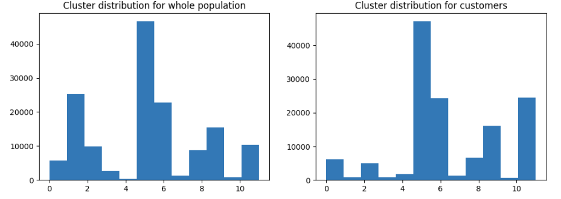
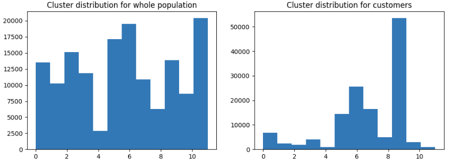
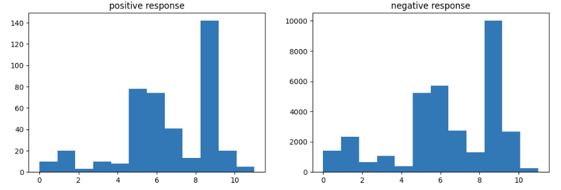

# Customer segmentation with demographic data

## Motivation
Customer segmentation plays an important role in data driven e-commerce. The goal is to separate customer data, that has been collected from the total population of non customers. With the separation, we can identify possible customers for our company and therefore can place advertisement or send out offers, to acquire new customers.  
In this blogpost, we will analyse demographic data, which was provided by Bertelsman and Arvato. The analysis is split up in two parts. In the first part we will use unsupervised learning methods to analyse and find new possible customers, which we can target with a marketing campaign. In the second part, we will train a supervised machine learning model with labeled data from a previous campaign to further narrow down possible customers, who will react to the offers we will send via mail.

1. [The Data](#the-data)
3. [Part 1 - Finding Potential Customers](#finding-potential-customers)
4. [Part 2 - Will They React to Our Offer?](#will-they-react-to-our-offer)
5. [Conclusion & Future Work](#conclusion)

## The Data
The data we have consists of four data sets. All data sets consist of 366 features that describe the demographic situation of each person. 
The features are things like age of main household person, age of children, ager group, but also things that describe the buying capacity of the area, the person lives in, e.g.: number of luxury vehicles in that area, number of single households, number of families, etc.
Some datasets have additional features and the datasets themselves are described below.

1. customers
	The customers describes the current customers of the company. Three additional features exist, that describe their purchase behaviour. (about 191k Customers)
	
2. azdias
	Representatively describing the whole population of Germany. (about 900 k people)
	
3. mailout_train
	Targets of a mailing marketing campaign. Additional to the features, this dataset contains their response to the marketing campaign as well. (boolean)

4. mailout_test
	Here we have the same data as mailout_train, but without the response labels

## Finding Potential Customers
The first task in this marketing campaign is trying to identified people, who are not already customers, that can potentially be acquired as customers. Therefore we will identify people in the azdias dataset that are most similar to our customer dataset.
For that purpose we will cluster the population data in multiple clusters and analyse if the customer dataset is visibly separable from the population.
Since the dataset contain a lot of features and a lot of people, we want to reduce the data without loosing information. To achieve that, we are going to test two dimension reduction methods and compare them with each other. After the dimension reduction, we will cluster the data using a standard clustering method, the Kmeans method.

### Dimension reduction
For the dimension reduction method, we tested two methods. We will compare the independent component analysis (ICA) with the principal component analysis (PCA). To compare them, the dimension of the datasets have been reduced and clustered using the same clustering method. The goal was to separate the customer dataset as much as possible form the azdias (population) dataset.  

In the figure below, we see that the ICA method does not work quite well with the KMeans. 

The data is not separated enough from the population, we can not clearly distinguish between customer dominant clusters and population clusters in general.

For the PCA method, we see that the cluster distribution for the population is homgenously and we can clearly see, that the customers are dominant in four main clusters.

Hence the PCA + KMeans pipeline was used to enrich the data with additional cluster numbers.

## Will They React to Our Offer?
To know if the potential clients identified will react to the mail offer, a classification pipeline was trained, based on a previous mail campaign (mailout_train dataset). When the clustering algorithm is applied to the data, we can see that the targets for the mail campaign have been pre-selected, since their distribution of the data is similar to the distribution of the current clients.

We can also see, that the group of people who reacted to the mail campaign are under represented, which will lead to problems, we will see further on.
The classification pipeline, as it can be seen below, consists of the sklearn Standard Scaler and a Suppert Vector Machine Classifier. The input data is the feature set, which we also had in the first part of the analysis and additionally the cluster labels, that were assigned by the clustering pipeline from part one. The aim of the grid search was to optimize the F1 score, which we selected as the appropriate metrics for this task.  
The results have shown, that a linear kernel performs best. With that in mind, the SVC was again optimised for different parameters for the SVC.

The initial approach to train the model would be to just start the training with the data and run a grid-search and cross-validation to tune the classifier in a more efficient way. The results are sobering since the F1 score is at 0.0230. The reason for the low performance of the model is probably due to the previously mentioned imbalance in the labels.
To overcome that, two simple approaches were applied. First, down-sampling was applied, which reduces the majorly representative class to the same size as the under-represented class. This helps to further reduce the data quantity and to balance out the two data-classes. This helped improve the f1 score drastically to 0.5683, but the score is still bad in general.
Another similar approach is to upscale the  under-represented data using the sklear resample function to increase the underrepresented class into a similar quantity. The up-sampling incresed the f1 score again to an acceptable 0.7942.

||No Preprocessing|Down-Sampling|Up-Sampling|
|-|-|-|-|
|F1-Score|0.0230|0.5683|0.7942|

## Conclusion
This analysis showed how to cluster and separate the customer group from the whole population using PCA for dimensionality reduction and KMeans for the clustering. PCA was also compared to ICA, but since the ICA clusters were not as clearly separable as the clusters created with the PCA, PCA was chosen.

After that, a clustering pipeline was trained to enhance the dataset provided to train a classifier. This data was cleaned, clustered and categorised. To classify the data correctly, a gridsearch was performed using SVM as a classifier. It was shown that the linear kernel was not only very fast for training but also performs best for the optimization. The metrics optimized was the F1 Score, since the data was highly imbalanced.

To handle the imbalance in the data, the data was upscaled, which improved the performance significantly.

### Further improvements

To further improve the classifier, there are a few things that can be changed.

First of all, different clustering and classifying algorithms can be compared to each other. Here we only took a look at one because the main problem here was that the data was highly imbalanced, but it is worth trying out other algorithms like DBScan for the clustering or XGBoost, Random Forest or even a Neural Network for classification as well.

In addition, more advanced techniques to handle imbalanced data can be applied, such as SMOTE or a Balance Bagging Classifier ([Further details here](https://www.analyticsvidhya.com/blog/2021/06/5-techniques-to-handle-imbalanced-data-for-a-classification-problem/)).
